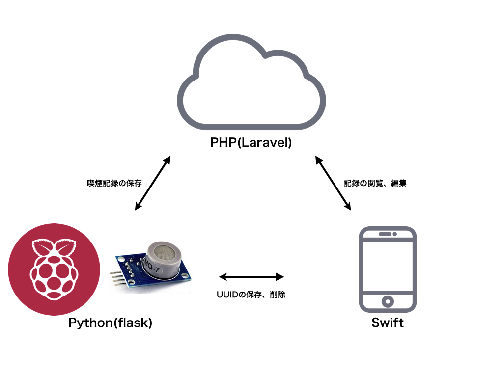

Smoke View(仮)
=============
## 概要
喫煙にかける時間や頻度をセンサーで自動収集し、そのデータを提示して自分の喫煙を把握できるアプリです。
センサーを使用してデータを収集するため、わざわざアプリを操作して喫煙記録を残す手間はありません。
また、喫煙の頻度からペースを予測し目標本数と比較を行い、注意を促したりしてくれます。

## 注意事項
* 1つのWi-Fiおよびセンサーにつき1人までしか記録・管理できません。
そのため、同じセンサーを使用して複数人が喫煙を行った場合、特定の1人が複数回喫煙をしたと記録されます。

## デモ

## サポート情報
* Xcode x.x
* iOS x.x
* iPhone 6,6s

## 使い方
1. ラズパイを設置・起動
2. ラズパイをWi-Fiに接続
3. ラズパイ上で[mq-7.py](raspberry-pi/mq-7.py)を動作させる
4. アプリを起動し設定を行う
    * 給与日
    * 吸っているタバコ1箱の値段
    * 1日の目標本数
    * Raspberry Piとのリンク
5. いつも通りタバコを吸う

## 参考にしたWebサイト
* [ラズパイとMQ-7センサーの接続](http://osoyoo.com/ja/2017/03/30/co检测器/)

## システムイメージ
